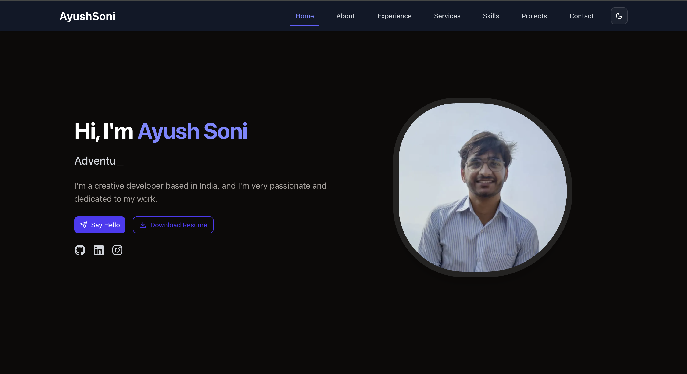

# 💼 Vaibhavi Deshpande – Developer Portfolio

A modern, responsive, and animated developer portfolio built using **Next.js**, **Tailwind CSS**, and **ShadCN UI**. This portfolio showcases projects, skills, services, and experience with smooth scroll, light/dark themes, and engaging animations.



---

## 🚀 Features

- ⚡ Built with **Next.js 15 App Router**
- 🎨 Styled with **Tailwind CSS + ShadCN UI**
- 🌙 Dark/Light mode toggle
- ✨ Smooth scroll and **Framer Motion** animations
- 📱 Fully responsive across devices
- 🧠 Projects section with cards, links, images, and animations
- 🛠 Services, Skills, Experience, About, and Contact sections
- 📎 Reusable components and clean folder structure
- 📬 Contact via email, LinkedIn, Twitter, GitHub

---

## 📂 Tech Stack

- **Next.js 15 (App Directory)**
- **TypeScript**
- **Tailwind CSS**
- **ShadCN/UI**
- **Framer Motion**
- **Lucide Icons**
- **Resend API**

---

## 🖼 Preview

> **Live Site**: [https://ayushsoni.dev](https://ayushsoni.dev)

---

## 🛠 Setup & Installation

```bash
# Clone the repository
git clone https://github.com/Vaibhavi020/portfolio-website.git
cd portfolio-nextjs

# Install dependencies
npm install

# Run locally
npm run dev
```

The app will be available at `http://localhost:3000`.

---

## 📁 Folder Structure

```
.
├── app/                # Next.js App Router
│   ├── page.tsx        # Home Page
│   ├── projects/       # Dynamic Projects Page
│   └── ...
├── components/         # Reusable Components (Navbar, Footer, Cards)
├── public/assets/      # Images & Static Assets
├── styles/             # Global Styles (if any)
├── data/               # Data files (e.g., projects array)
├── utils/              # send email function
```

---

## 📸 Projects

Projects are dynamically loaded using a project array. Each project card includes:

- ✅ Title
- ✅ Description with "Show More"
- ✅ GitHub + Live Links
- ✅ Image
- ✅ Hover animation, border, and reveal on scroll

Private projects can still be listed with image + description, omitting links.

---

## 📬 Contact

If you'd like to collaborate or connect:

- 📧 Email: [vaibhavideshpande0213@gmail.com](mailto:vaibhavideshpande0213@gmail.com)
- 🔗 [LinkedIn](https://www.linkedin.com/in/vaibhavi020/)
- 🐦 [Twitter](https://twitter.com/)
- 💻 [GitHub](https://github.com/Vaibhavi020)

## 🙏 Acknowledgements

- [Next.js](https://nextjs.org/)
- [Tailwind CSS](https://tailwindcss.com/)
- [ShadCN UI](https://ui.shadcn.dev/)
- [Framer Motion](https://www.framer.com/motion/)
